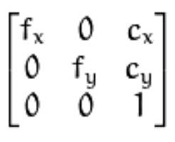

# Visual-Odometry
Python and OpenCV program to estimate Fundamental and Essential matrix between successive frames to estimate the rotation and the translation of the camera center.

## 1.  Preprocessing

 1.1 Bayer2BGR conversion: The input image frames are in Bayer format. They are converted into color images using OpenCV inbuilt cvtColor function.
    1.2 Camera Parameter Extraction: Camera matrix parameters such as focal length fx, fy and optical center cx, cy are extracted using given ‘ReadCameraModel’ function.
    1.3 Undistort the image: Given input frames have some lens distortion. It is removed using ‘getUndistoredImage’ function provided. In every iteration, this function is run on current as well as the next frame. Resultant frames are used for feature matching.

   
## 2. Feature Detection

2.1 SIFT features: For feature detection, we use the SIFT detector to detect features in consecutive frames. We create a SIFT detector object and pass the two frames to it to the detector and use the correspondences we get for calculation of the Fundamental Matrix.

  

## 3. Calculate Fundamental Matrix

3.1 Eight-Point Algorithm with RANSAC: For the calculation of Fundamental Matrix, we use the Eight-Point Algorithm with RANSAC. To make fundamental matrix estimation more robust to outliers, we implemented Zhang’s eight point extraction algorithm which is a modification of Hartley’s normalized 8-point algorithm. In this method, we divide the image into a 8x8 grid and then randomly select a grid first and then within a grid we randomly select a point. Once we get random 8 points from this, we calculate an intermediate F matrix using these 8 points and test its correctness by calculating the error by substituting all the corresponding feature points in the equation e = X’ F X. If e is less than the threshold value 0.05, it is counted as an inlier. This process is repeated for N number of times and F matrix with maximum number of inliers is returned as the best F along with those inliers. 

 3.2 Normalization: We perform normalization of the 8 points we select,  by shifting them around the mean of the points and enclose them at a distance of √2 from the new center. We use these normalized points to solve the following equation:

  

 3.3 Solving for F Matrix: Here, the xi,yiand x'i,,y'iare the normalized points. We solve this using SVD, and the solution is in the last column of the V matrix. 
    3.4 Filtering Noise in F Matrix: Due to noise, we filter out the F matrix by: Enforcing a rank 2 condition on the F matrix by making the last Eigenvalue zero ( in the S matrix). Reconstructing the F matrix from the new S matrix. Retransform the F matrix using the Transformation matrix we created by normalizing the points. Divide the F matrix by its norm. Check if the last element of the F matrix is negative. If true, negate the entire matrix. The last element represents the scaling factor and hence needs to be positive.
      3.5 RANSAC for finding inliers: Using the F matrix we found, get the error by finding the product x'iFxi. The threshold is set to 0.05. All the points giving the error more than the threshold are considered inliers. The maximum inliers after 300 iterations are stored and used to get the final F matrix.  

## 4. Estimation of the Camera Poses

4.1 Calculation of K matrix: Once we get the final F matrix, next thing that is needed to be calculated is the camera calibration matrix K. It is calculated using fx, fy, cx and cy as follows:

  

4.2 Calculation of the E matrix: Essential matrix E is used to compute the relative camera poses between two image frames. It is simply calculated by using the formula E = KTFK. Due to noise in the K matrix, the diagonal matrix of the E matrix is not necessarily equal to [1 1 0]. Hence, SVD is taken of E matrix and D matrix is forced to be equal to [1 1 0]. Then E matrix is recalculated using this new D matrix. 
     4.3 Calculation of the camera poses: E matrix is decomposed again using SVD matrices U, D and V’ and it’s diagonal matrix is replaced the W and W’ matrix. Where W matrix is:

  

This results in two Rotation matrices. R1 = UWTVTand R2 = UWVT. Also, two resulting translation vectors are calculated as the last column of the U matrix. C1 = -U(:,3), C2 = U(:,3). 
Constraint: the determinant of the rotation matrix cannot be negative. Thus if the determinant is found to be negative, we negate it by multiplying with -1 and also we negate the corresponding C vector.

## 5. Pose Estimation

5.1 Linear Triangulation: in order to estimate the correct camera pose from the four camera poses that we obtained above, a linear triangulation method is used. It is done by calculating the 3D world coordinate X from the corresponding two feature points x and x’ on the two frames. It follows the logic that for a correct pair of the rotation and the translation matrix, the point X would be in front of the camera position in the world. Ie r3(X - C) > 0. Here, r3 is the third column of the rotation matrix. Since there is noise in the input, this equation won’t be satisfied by each and every corresponding pair. Hence, we pick out that pair of R and C for which there are a maximum number of points satisfying this equation.

## 6. Plot Camera Center: 

6.1 Estimation of the Camera center: The translation vector that is calculated above is wrt to the car frame. Thus it is necessary to convert it into the world frame for plotting the trajectory. For this we use the best estimated ‘Rnew’ matrix and ‘Tnew’ vector calculated above.
To get the translation vector and the orientation in the world frame following equations are used:
T_world = T_World + (Rnew * Tnew)
    R_world = R_world * Rnew
Here R_world and T_world are the orientation and translations in the world frame.

## 7. Output:

7.1 Camera position plot generated using our methods: 
    X coordinate is plotted on x-axis as it represents side motion of the car in the world frame and Z coordinate is plotted on  y-axis as it represents the forward motion of the car in the world frame.

### 1. Output with ORB feature matching and without Zhang’s 8 point selection:

  

### 2. Output with SIFT feature matching and with Zhang’s 8 point selection:

  

## 8. Observation:

Following observations can be made from the above outputs:
Zhang’s 8 point algorithm gives a more robust estimation of inliers resulting in more accurate Fundamental matrix calculation.
SIFT feature matching produces more number of feature points relative to ORB features. 
    Thus combining the above two methods, we get faster and more appropriate trajectory generation plot.
Linear triangulation only corrects the algebraic error. However, reprojection error persists and gets accumulated over the iterations and as a result, there is some deviation from the correct trajectory.

